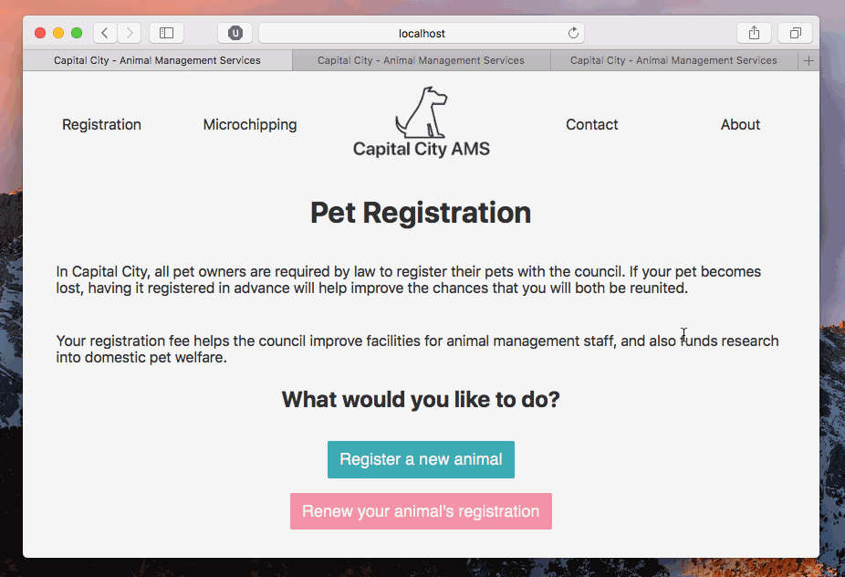
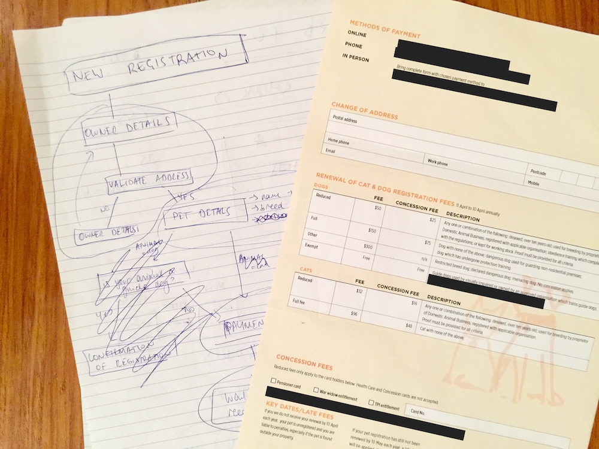

# cfa-project
This repository is a single page web application built with `choo`.

It serves as the website for an animal management service within a fictional government body. On this website you can do the following:

- Register your animal
- Learn about pet microchipping
- Find the organisation's contact details
- Learn more about animal management services



## Environments
`cfa-project` should run in any environments that support [Node.js](https://nodejs.org), but it has been developed and tested on `Mac OS X 10.10`, using `Node.js v6.10.3 LTS`.

While this repository should run smoothly on most operating systems, you may have runtime issues if you are using Windows. This code has *not* been tested on Windows.

## Installation
To install and run `cfa-project`, clone and then navigate to the repository:

```
$ git clone https://github.com/georgiah/cfa-project
$ cd cfa-project
```

You must install `cfa-project`'s dependencies before running for the first time:

```
$ npm install
```

## Start
To spin up a development server, run the following:

```
$ npm start
```

A development server will now be running at `localhost:8080`.

## Test
To test our code for any syntax issues, you can run the following command which will ask `standard` to parse our code for any errors:

```
$ npm run test
```

## Build
To compile the final application, run the following:

```
$ npm run build
```

A self-contained and optimised version of the application should now be available in the `dist` folder.

## Discussion


The flow of the site was roughly modelled off a real-life animal registration form that I received in the mail.
I wanted to mimic the flow of the form on the website, and add in the capability to identify yourself and have your animals prepopulate in the form.

Due to time restrictions, this online replica significantly simplifies the paper version, removing options to change an existing address and declare a pet as deceased.

I made the decision when modelling the state to include both `state.newPet` and `state.pets` properties, which may seem confusing, and I agree may be less than ideal.

My intention was to allow a new animal registration to manipulate its own state property rather than `state.pets[0]`. If the functionality was extended to allow existing owners to add a new pet then there would be no need to continually check on the current status of `state.pets`.

In future iterations, this would be an aspect I would consider revisiting and updating to a more elegant solution.

In an attempt to mimic the behaviour of calling an external API, I created an `api` module that triggers a loading animation to run before showing a mocked response. This was done to demonstrate how I would represent asynchronous requests in the user interface.

The payments screen renders a breakdown of the payment total based on the value of `state.pets` and `state.newPet`. The function that calculates the cost for each animal, `petCost`, relies on a series of conditional statements to output a `cost` object.

Given the time restrictions on this project, I think this is an effective way to determine these values.

## License
MIT
